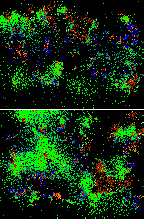



## Microbes

### Description

Simulate the 3 types of microscopic organisms bacteria, virii and fungi!
 
### More Info
 
Uses a controller

It is non relient on extra things, only built in vb6

graphical display of the life forms

Uses quite a bit of CPU

             |
---                |---
**Submitted On**   |2008-04-26 16:47:54
**By**             |[Ashley Newson](https://github.com/Planet-Source-Code/PSCIndex/blob/master/ByAuthor/ashley-newson.md)
**Level**          |Intermediate
**User Rating**    |5.0 (10 globes from 2 users)
**Compatibility**  |VB 6\.0
**Category**       |[Miscellaneous](https://github.com/Planet-Source-Code/PSCIndex/blob/master/ByCategory/miscellaneous__1-1.md)
**World**          |[Visual Basic](https://github.com/Planet-Source-Code/PSCIndex/blob/master/ByWorld/visual-basic.md)
**Archive File**   |[Microbes2127229162008\.zip](https://github.com/Planet-Source-Code/ashley-newson-microbes__1-71089/archive/master.zip)

